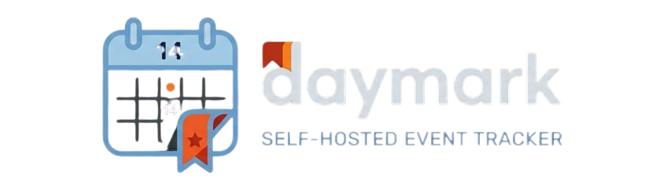

<p align="center">
  
</p>

<h1 align="center">Daymark</h1>

<p align="center">
  <strong>Your self-hosted, privacy-first, mobile-friendly event tracker & countdown board.</strong>
</p>

<p align="center">
  
</p>

---

## 🌟 Key Features

- 📅 **Milestone Tracking**: Seamless countdowns (upcoming events) and count-ups (past events) to monitor exactly how much time remains or has elapsed.
- 📲 **PWA & Mobile-First**: Built from the ground up to render beautifully on mobile browsers. Fully installable as a standalone Progressive Web App.
- 🎨 **Premium Aesthetic**: Modern, responsive glassmorphic dark interface with deep-neon interactive elements, smooth radial orbs, and custom mesh gradients.
- 📱 **Multiple Visual Layouts**: 
  - **List View**: High-density lists with compact status badges.
  - **Card View**: Styled glass container grids with customizable radial gradients.
  - **Poster View**: Vertical Apple Invites-style portrait frames with deep-vignetted custom background image URLs.
- 📝 **Categorization & Custom Icons**: Create custom color-coded categories and select from a flat-grid emoji picker of 64 preset icons.
- 🔒 **Self-Hosted Security**: Protect your data with authorization middleware powered by Next.js and Prisma, backed by a local PostgreSQL database container.
- 🤖 **Telegram Notifications**: Set up automated event alerts (3, 2, or 1 day(s) before and on the day of the event) delivered directly to your Telegram bot.
- ⏰ **Integrated Cron Worker**: Background scheduler runs continuously inside the Docker container to ensure event reminders are always dispatched on time.

---

## 🚀 Deploying with Docker Compose (Recommended)

Deploying Daymark is easy. You can run the entire stack (Next.js Application, PostgreSQL Database, and Background Reminder Cron) using a single command.

### Prerequisites

Ensure you have [Docker](https://www.docker.com/) and [Docker Compose](https://docs.docker.com/compose/) installed on your machine.

### Run the Application

1. Clone or download the repository to your server/machine.
2. In the root directory (where `docker-compose.yml` is located), start the services:

```bash
docker compose up -d --build
```

3. Once built and started, open your browser and navigate to:
   - **Main Web Interface**: [http://localhost:3000](http://localhost:3000)

---

## ⚙️ Environment Configuration

You can customize the deployment behaviour inside `docker-compose.yml` under the `app` service environment block:

| Variable | Description | Default Value |
| :--- | :--- | :--- |
| `DATABASE_URL` | PostgreSQL connection URL string. | `postgresql://daymark:password@db:5432/daymark` |
| `JWT_SECRET` | Secret key used for signing session auth tokens. | `super_secret_jwt_key_daymark_2026` |
| `CRON_TOKEN` | Auth token used to authorize the background trigger ping. | `token_for_cron_reminder_dispatch` |
| `NODE_ENV` | Next.js environment setting. | `development` |

---

## ⚙️ App Setup & Telegram Reminders

1. **Initial Admin Onboarding**: When you open [http://localhost:3000](http://localhost:3000) for the first time, you will be redirected to `/register` to create the initial admin account.
2. **Setting Up Telegram Notifications**:
   - Go to your Telegram app and search for `@BotFather`. Follow the prompts to create a new bot and obtain the **Bot Token**.
   - Create a chat or group and retrieve your **Chat ID** (you can use bots like `@userinfobot` to retrieve it).
   - In Daymark, go to **Settings** in the top navigation menu, toggle **Enable Telegram Notifications**, enter your **Bot Token** and **Chat ID**, and click **Save Settings**.
   - Click **Send Test Telegram Message** to verify your setup works instantly!

---

## 🛠️ Development Setup

If you wish to run and modify Daymark locally without Docker:

### 1. Install Dependencies

```bash
npm install
```

### 2. Configure Database & Prisma

Set up a local Postgres database, define the `DATABASE_URL` in a `.env` file, then push the database schema:

```bash
npx prisma db push
npx prisma generate
```

### 3. Run Development Server

```bash
npm run dev
```

The site will be running at [http://localhost:3000](http://localhost:3000). The development command also starts the background cron script in parallel to trigger notifications.
